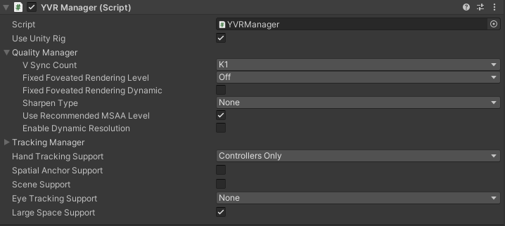

# Location Based Entertainment (LBE) Support

> [!note]
>
> For more information, please refer to our open source project [LBE Sample](https://github.com/PlayForDreamDevelopers/LBESample-Unity).

To utilize LBE-related interfaces, first enable the "Large Space Support" option on the YVRManager script:



LBE-related interfaces are defined in [LBEPlugin][lbe-plugin] and currently include:

| Interface                                                              | Description                                                                                                                                                                                                 |
| ---------------------------------------------------------------------- | ----------------------------------------------------------------------------------------------------------------------------------------------------------------------------------------------------------- |
| [GetGroundDistance][get-ground-distance]                               | Retrieves the ground distance                                                                                                                                                                               |
| [SetMarkerDetectionEnable][set-marker-detection-enable]                | Enables or disables marker detection                                                                                                                                                                        |
| [SetMarkerTrackingUpdateCallback][set-marker-tracking-update-callback] | Registers a callback for marker tracking updates. The callback is triggered when markers are detected, with the parameter containing [MarkerTrackingUpdateData][marker-tracking-update-data] structure data |
| [SetRecenterEnable][set-recenter-enable]                               | Enables or disables recentering                                                                                                                                                                             |
| [GetRecenterEnable][get-recenter-enable]                               | Gets the current recentering status                                                                                                                                                                         |

Example of registering a marker callback:

```csharp
// ...existing code...
LBEPlugin.instance.SetMarkerDetectionEnable(true);
LBEPlugin.instance.SetMarkerTrackingUpdateCallback(OnReceiveMarkerTrackingUpdateData);

private void OnReceiveMarkerTrackingUpdateData(MarkerTrackingUpdateData data)
{
    // ...existing code...
}
```

[lbe-plugin]: xref:YVR.Enterprise.LBE.LBEPlugin
[get-ground-distance]: xref:YVR.Enterprise.LBE.LBEPlugin.GetGroundDistance
[set-marker-detection-enable]: xref:YVR.Enterprise.LBE.LBEPlugin.SetMarkerDetectionEnable(System.Boolean)
[set-marker-tracking-update-callback]: xref:YVR.Enterprise.LBE.LBEPlugin.SetMarkerTrackingUpdateCallback(System.Action{YVR.Enterprise.LBE.MarkerTrackingUpdateData})
[marker-tracking-update-data]: xref:YVR.Enterprise.LBE.MarkerTrackingUpdateData
[set-recenter-enable]: xref:YVR.Enterprise.LBE.LBEPlugin.SetRecenterEnable(System.Boolean)
[get-recenter-enable]: xref:YVR.Enterprise.LBE.LBEPlugin.GetRecenterEnable
